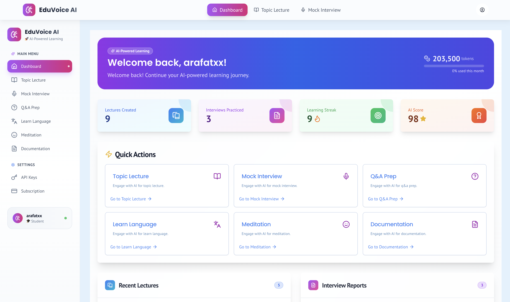
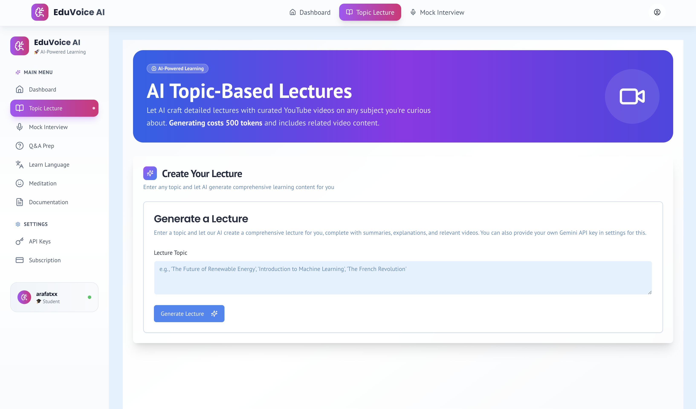
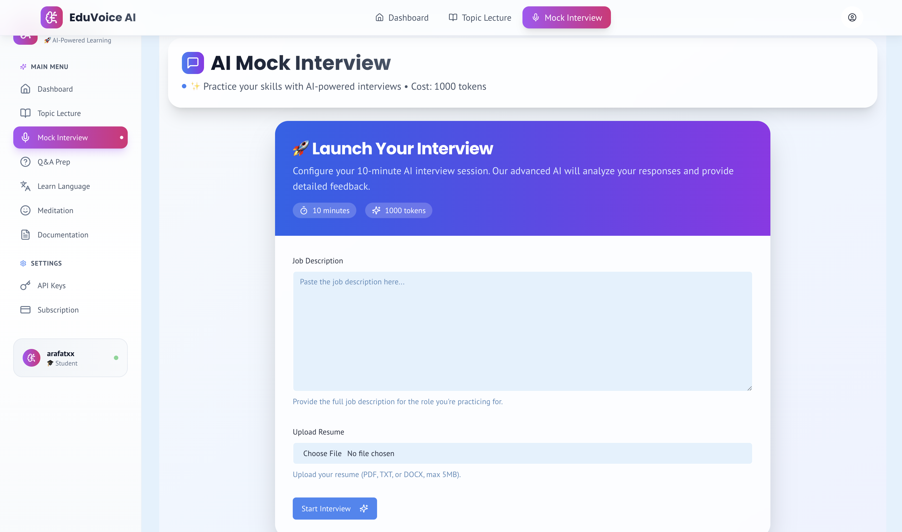
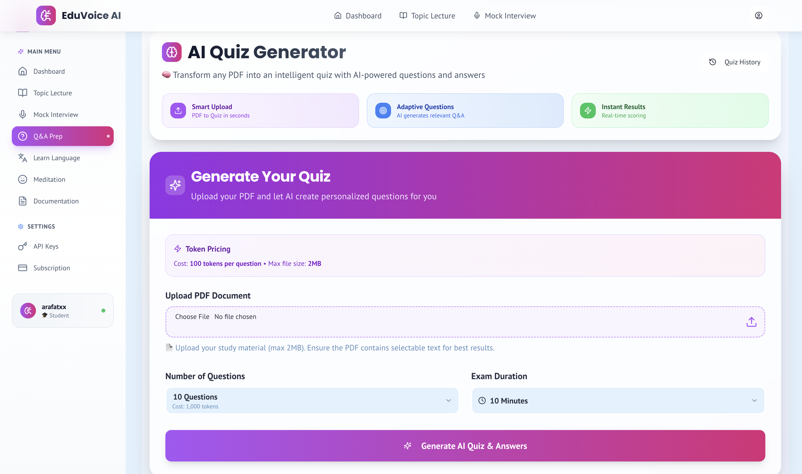
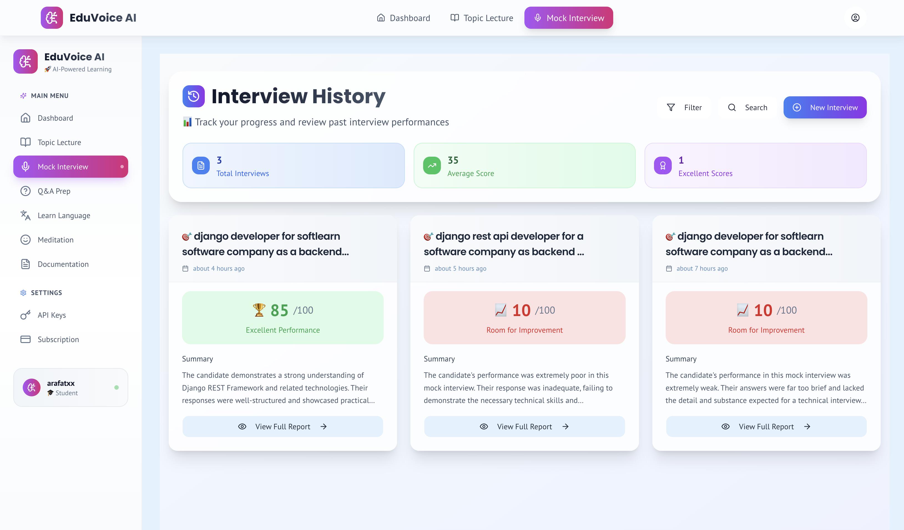
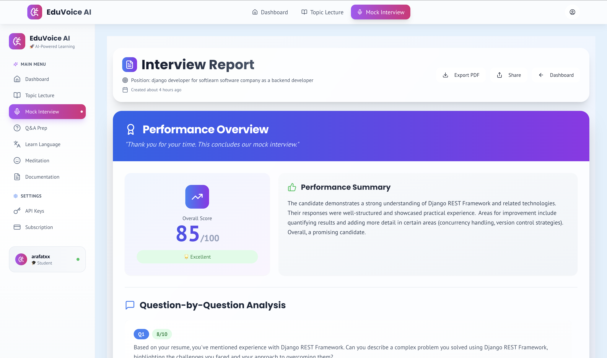
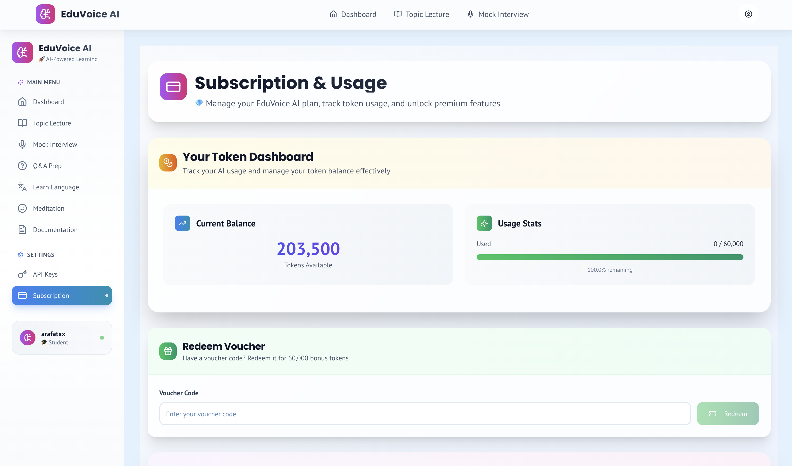
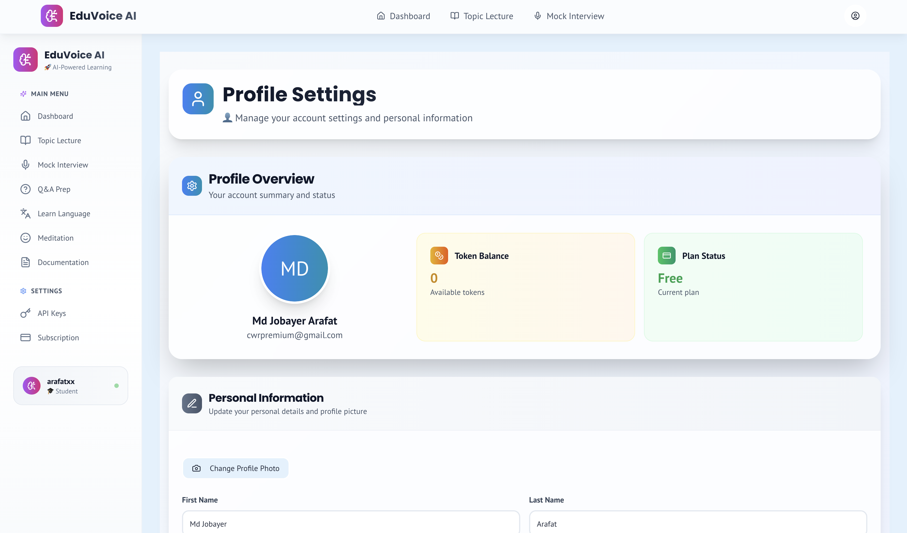

# 🧠 EduVoice AI - AI-Powered Learning Platform

<div align="center">


**Transform your education with AI-powered voice interactions, personalized lectures, mock interviews, and intelligent quiz preparation.**

[](https://nextjs.org/)
[](https://www.typescriptlang.org/)
[](https://tailwindcss.com/)
[](https://ui.shadcn.com/)
[](https://opensource.org/licenses/MIT)

[🚀 Live Demo](https://eduvoiceai.vercel.app) | [📖 Documentation](https://eduvoiceai.vercel.app/docs) | [🎯 Features](#-features)

</div>

---

## 🌟 Overview

EduVoice AI is a revolutionary educational platform that leverages advanced artificial intelligence to create personalized learning experiences. Whether you're a student preparing for exams, a professional practicing for interviews, or someone looking to expand your knowledge on any topic, EduVoice AI provides intelligent, interactive tools to accelerate your learning journey.

### 🎯 Key Highlights

- **🤖 AI-Powered Learning**: Generate comprehensive lectures on any topic
- **🎙️ Mock Interview Practice**: Practice with AI that provides real-time feedback
- **📝 Smart Quiz Generation**: Create custom quizzes from your study materials
- **🎬 YouTube Integration**: Curated video content for enhanced learning
- **💰 Token-Based System**: Fair and flexible pricing model
- **🔒 Secure & Private**: Enterprise-grade security with OAuth support

---

## 🖥️ Screenshots

<div align="center">

### Dashboard Overview


### AI Lecture Generation


### Voice Interview Practice


### Smart Q&A Sessions


### Interview History


### Performance Reports


### Lecture Details


### Subscription Management


### User Profile


</div>

---

## ✨ Features

### 🎓 AI Lecture Generation
- **Cost**: 500 tokens per lecture
- Generate comprehensive educational content on any topic
- AI-curated YouTube video integration
- Downloadable playlists and summaries
- Unlimited topics and subjects
- Interactive content with real-time explanations

### 🎤 Mock Interview Practice
- **Cost**: 1000 tokens per session
- Upload resume and job descriptions
- AI asks relevant, industry-specific questions
- Real-time feedback and performance scoring (0-100)
- 10-minute timed sessions
- Detailed improvement recommendations
- Question-specific analysis

### 📋 QA Quiz Preparation
- **Cost**: 50 tokens per question
- Upload PDF study materials (max 10MB)
- Generate 10-50 custom questions
- Timed exam simulation (10-50 minutes)
- Detailed scoring and analytics
- Question-by-question feedback
- Progress tracking

### 💎 Additional Features
- **🎯 Admin Dashboard**: Comprehensive user management
- **🔌 API Integration**: Connect OpenAI, Gemini, or Claude keys
- **🛡️ Enterprise Security**: OAuth support and data protection
- **📱 Responsive Design**: Works on all devices
- **🌙 Dark Mode**: Eye-friendly interface
- **🌍 Multi-language Support**: Learn in multiple languages

---

## 🚀 Quick Start

### Prerequisites
- Node.js 18+ 
- npm or yarn
- Git

### Installation

1. **Clone the repository**
   ```bash
   git clone https://github.com/yourusername/eduvoiceai.git
   cd eduvoiceai
   ```

2. **Install dependencies**
   ```bash
   npm install
   # or
   yarn install
   ```

3. **Set up environment variables**
   ```bash
   cp .env.example .env.local
   ```

   Configure your environment variables:
   ```env
   NEXTAUTH_SECRET=your-secret-key
   NEXTAUTH_URL=http://localhost:3000

   # Database
   DATABASE_URL="your-database-url"

   # AI Providers
   OPENAI_API_KEY=your-openai-key
   GEMINI_API_KEY=your-gemini-key
   CLAUDE_API_KEY=your-claude-key

   # YouTube API
   YOUTUBE_API_KEY=your-youtube-key

   # OAuth Providers
   GOOGLE_CLIENT_ID=your-google-client-id
   GOOGLE_CLIENT_SECRET=your-google-client-secret
   ```

4. **Run the development server**
   ```bash
   npm run dev
   # or
   yarn dev
   ```

5. **Open your browser**
   Navigate to [http://localhost:3000](http://localhost:3000)

---

## 📚 How It Works

### 1. **Create Account**
Sign up and get **60,000 free tokens** to start your learning journey

### 2. **Choose Feature**
Select from AI Lectures, Mock Interviews, or QA Preparation

### 3. **Generate Content**
Our AI creates personalized educational content for you

### 4. **Learn & Practice**
Engage with content, practice skills, and track your progress

---

## 🎯 Token System

EduVoice AI uses a fair, token-based pricing system:

| Feature | Cost | Description |
|---------|------|-------------|
| 🎓 AI Lecture Generation | 500 tokens | Comprehensive lectures with YouTube integration |
| 🎤 Mock Interview Practice | 1000 tokens | 10-minute sessions with detailed feedback |
| 📝 QA Quiz Questions | 50 tokens/question | Custom quizzes from your materials |

### 🎁 Pricing Plans

| Plan | Price | Tokens | Features |
|------|-------|--------|----------|
| **Free Trial** | $0 | 60,000 | Full access to all features |
| **Monthly Plan** | $10/month | Unlimited | Priority support, advanced features |

---

## 🛠️ Tech Stack

### Frontend
- **Framework**: Next.js 14 with App Router
- **Language**: TypeScript
- **Styling**: Tailwind CSS
- **UI Components**: Shadcn/ui
- **Icons**: Lucide React
- **Animations**: CSS Transitions

### Backend
- **Database**: PostgreSQL with Prisma ORM
- **Authentication**: NextAuth.js
- **File Upload**: Cloudinary/AWS S3
- **AI Integration**: OpenAI, Google Gemini, Anthropic Claude

### Deployment
- **Platform**: Vercel
- **Database**: Neon/PlanetScale
- **CDN**: Cloudflare

---

## 📁 Project Structure

```
eduvoiceai/
├── src/
│   ├── app/
│   │   ├── (marketing)/          # Marketing pages
│   │   │   ├── page.tsx          # Landing page
│   │   │   └── docs/
│   │   │       └── page.tsx      # Documentation
│   │   ├── dashboard/            # User dashboard
│   │   ├── lectures/             # AI lecture generation
│   │   ├── interviews/           # Mock interview practice
│   │   └── qa-prep/              # Quiz preparation
│   ├── components/
│   │   ├── ui/                   # Reusable UI components
│   │   └── marketing/            # Marketing components
│   ├── lib/
│   │   ├── ai/                   # AI integration utilities
│   │   ├── auth/                 # Authentication config
│   │   └── utils.ts              # Utility functions
│   └── styles/
│       └── globals.css           # Global styles
├── public/
│   ├── screenshots/              # Project screenshots
│   └── eduvoiceai.png           # Logo
└── docs/                         # Additional documentation
```

---

## 🤝 Contributing

We welcome contributions! Please follow these steps:

1. **Fork the repository**
2. **Create a feature branch**
   ```bash
   git checkout -b feature/amazing-feature
   ```
3. **Make your changes**
4. **Commit your changes**
   ```bash
   git commit -m 'Add some amazing feature'
   ```
5. **Push to the branch**
   ```bash
   git push origin feature/amazing-feature
   ```
6. **Open a Pull Request**

### 📋 Contributing Guidelines
- Follow the existing code style
- Add tests for new features
- Update documentation as needed
- Ensure all tests pass

---

## 📄 License

This project is licensed under the MIT License - see the [LICENSE](LICENSE) file for details.

---

## 👨‍💻 About the Developer

**EduVoice AI** was founded and developed by **Md Jobayer Arafat**, a passionate developer dedicated to revolutionizing education through artificial intelligence.

<div align="center">

[](https://www.linkedin.com/in/md-jobayer-arafat-a14b61284/)
[](https://github.com/mdjobayerarafat)
[](https://jobayerarafat.dev)

</div>

---

## 🆘 Support

- 📖 **Documentation**: [eduvoiceai.vercel.app/docs](https://eduvoiceai.vercel.app/docs)
- 💬 **Issues**: [GitHub Issues](https://github.com/yourusername/eduvoiceai/issues)
- 📧 **Email**: support@eduvoiceai.com
- 💼 **LinkedIn**: [Md Jobayer Arafat](https://www.linkedin.com/in/md-jobayer-arafat-a14b61284/)

---

## 🌟 Show Your Support

If you find EduVoice AI helpful, please consider:

- ⭐ **Starring** this repository
- 🐛 **Reporting** bugs and issues
- 💡 **Suggesting** new features
- 🤝 **Contributing** to the codebase
- 📢 **Sharing** with friends and colleagues

---

## 🔄 Changelog

### v1.0.0 (Latest)
- ✅ AI-powered lecture generation
- ✅ Mock interview practice with scoring
- ✅ QA quiz preparation from PDFs
- ✅ YouTube integration
- ✅ Token-based pricing system
- ✅ OAuth authentication
- ✅ Responsive design
- ✅ Dark mode support

---

## 🗺️ Roadmap

- [ ] **Mobile App**: Native iOS and Android apps
- [ ] **Live Sessions**: Real-time group learning sessions
- [ ] **AI Tutoring**: One-on-one AI tutoring sessions
- [ ] **Certification**: Generate certificates for completed courses
- [ ] **Team Features**: Collaborative learning for organizations
- [ ] **Advanced Analytics**: Detailed learning analytics dashboard

---

<div align="center">

**Made with ❤️ by [Md Jobayer Arafat](https://www.linkedin.com/in/md-jobayer-arafat-a14b61284/)**

---

**🚀 Ready to transform your learning experience? [Get Started Now!](https://eduvoiceai.vercel.app)**

⭐ **Don't forget to star this repository if you found it helpful!**

</div>
